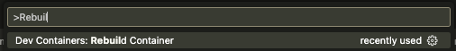
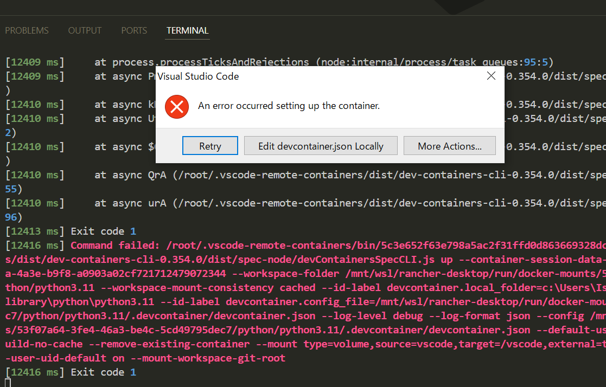
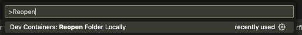

# How To Use

## 事前準備

- VSCode
- Docker Container
- Rancher Desktop or Docker Desktop for XXXのインストール

## 起動方法

1. 各ディレクトリに移動して、そのフォルダをVSCodeで開く
2. Dev Container: Rebuild container を実行する

**Windowsの場合の注意**
起動時以下のようなエラーが出る場合があるが「Retry」を押すと解消されることが多い

## 終了方法

1. Dev Container: Reopen Folder Locally を実行する

