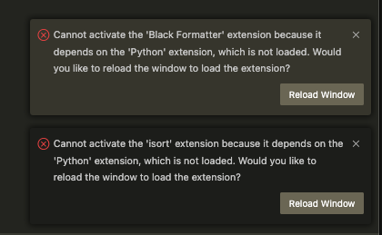
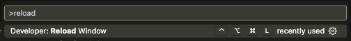

# How To Use

## Hello World

```shell
$ python src/sample.py 10
1
2
Fizz
4
Buzz
Fizz
7
8
Fizz
Buzz
```

## Run Test

```shell
$  python -m pytest tests
====================================== test session starts =======================================
platform linux -- Python 3.11.6, pytest-7.4.4, pluggy-1.4.0
rootdir: /workspaces/devcontainer-library/python/python3.11
configfile: pyproject.toml
plugins: mock-3.12.0, requests-mock-1.11.0
collected 1 item

tests/test_sample.py .                                                                     [100%]

======================================= 1 passed in 0.01s ========================================
```

## Add/Remove Package

- pyproject.toml に追加される

```shell
$ poetry add requests
```

- pyproject.toml から削除される

```shell
$ poetry remove requests
```

- 最後に以下を実行する

```shell
$ poetry install
```

# Troubleshooting

## Rebuild した場合に以下のエラーが発生



Reload Window を実行する


